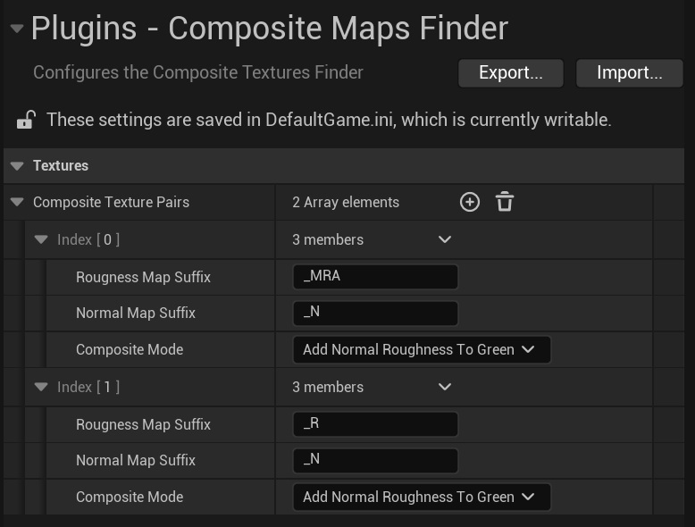

# Composite Textures Finder
Unreal's [composite textures](https://dev.epicgames.com/documentation/unreal-engine/composite-texture?application_version=4.27) are one of the engine's most underappreciated features. By increasing the roughness in the roughness map's mip maps based on how much detail gets lost in the matching normal map mip maps, it accounts for the increased sub-texel geometric detail when looking at 3D objects from a a distance (Yeah, that sentence is a mouthful. Check out the documentation for a more detailed explanation). This not only helps to enhance a game's realism, it also helps to reduce specular aliasing, resulting in a cleaner image. And since the computation happens completely offline during the mip map generation, it also doesn't affect runtime performance or memory usage.

Sadly, many people aren't aware of it, or, if they are, choose not to use it, because it is admittedly a bit annoying to use. For every single roughness map in your project, you have to specify the matching normal map manually and select the channel in which the roughness map is stored. On big projects with textures provided by artists, interns, outsourcers and asset packs, it can get quite challenging to do that consistently. Wouldn't it be easier to enable this feature globally once have it applied to all textures automatically?
The **Composite Textures Finder** plugin allows you to do exactly that: Instead of setting the composite map for each roughness map manually, you can just specify the suffixes for roughness maps and normal maps and the composite mode to use in your project settings, and the plugin sets the composite textures automatically whenever the textures get saved, no manual interventions needed.
## How to use the Plugin
After enabling and compiling the plugin, just open its settings in the Project Settings:


Here, you can define pairs of suffixes for roughness and normal maps and the composite modes to use for them. In the screenshot above, there are two pairs: One for 'pure' roughness maps ('_R'), which get their red channel modified as result of the composition, and one for packed MRA maps, which get their green channel changed.
The plugin only matches textures that share the same name (suffixes aside) and are in the same directory.
Examples:
```
# A pair
/Game/Environment/Textures/T_Pavement_R
/Game/Environment/Textures/T_Pavement_N

# Not a pair
/Game/Environment/TilingTextures/T_Pavement_R
/Game/Environment/Textures/T_Pavement_N

# Also not a pair
/Game/Environment/Textures/T_PavementTrim_R
/Game/Environment/Textures/T_Pavement_N
```
This means that for the plugin to work, you need to use a consistent naming convention in your project. Depending on your project's structure, you may need to add additional settings, prefixes or forbidden words, but for most, the existing implementation should suffice.
You may wonder _"Wait, what if I really don't want to use composite textures for a specific roughness texture? Is there a way to prevent the automatic assignment?"_ Short answer: No. Slightly longer (and better) answer: While you can't disable the plugin for individual textures, you can set the composite power to 0 to effectively disable it.
If you compile your engine yourself, I also recommend [adding an asset registry tag](https://haukethiessen.com/people-dont-use-asset-registry-tags-enough), enabling you to search for textures with or without composite textures.

## Some technical Details
The plugin was developed and tested using Unreal 5.6, but should work with any version. It requires the data validation plugin, which got introduced quite early during Unreal 4's life cycle.
While I tried to test the plugin as thoroughly as possible, I didn't ship an actual game with it, so I wouldn't consider it bulletproof yet. If you find any issues, feel free to raise an issue, make a pull request or reach out to me. If you end up using this plugin to ship a game, I'd be happy to hear from you🤗.

## License
This plugin is free to use in commercial and non-commercial products. This software is provided 'as-is', without any express or implied warranty. In no event will the authors be held liable for any damages arising from the use of this software. Permission is granted to anyone to use this software for any purpose, including commercial applications, and to alter it and redistribute it freely. Attribution is appreciated, but not required.
